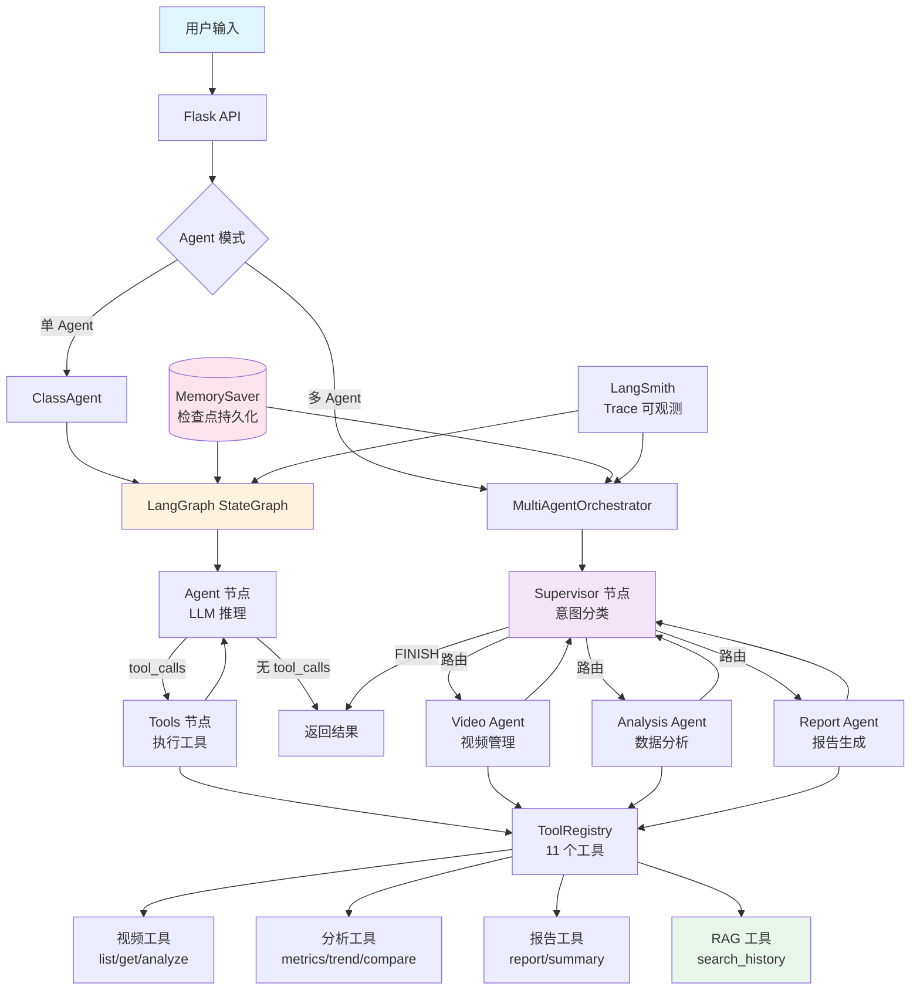

# 面向课堂场景的学生头部姿态估计与专注状态识别研究

基于视频抽帧与计算机视觉的课堂学生听课状态自动化分析系统，实现学生目标检测、多目标跟踪、头部姿态估计与专注状态识别。

## 项目背景

随着智慧校园、线上巡课、数字化教学督导不断普及，传统课堂学情管理方式逐渐显现弊端：

- **人工观测效率低、主观性强** - 巡课人员与授课教师仅依靠肉眼主观判断学生听课状态，无法实现整节课不间断、标准化量化统计
- **课堂学情数据难以量化留存** - 传统教学管理只能定性描述课堂氛围好坏，无法精准统计不同时段学生专注程度
- **无法区分真实学习行为与违纪行为** - 日常课堂中学生低头行为包含正常记笔记、看书学习与放空走神两类行为
- **课后教学复盘缺少数据依据** - 授课教师难以直观掌握整节课学生注意力波动规律
- **传统视频全帧分析落地成本高** - 完整解析一整节45分钟课堂视频运算量大、耗时久

## 研究目的

针对课堂场景多人密集、遮挡频繁、远距离人脸偏小、姿态多变等问题，本课题融合多目标跟踪、轨迹分析与头部姿态估计技术，实现对学生的稳定定位、身份保持、运动轨迹记录，以及抬头、低头、侧视三类专注状态的精准判定，构建轻量化、非侵入式的课堂状态分析系统。

## 研究意义

- **教学实践意义**：以视觉技术替代人工观察，实现课堂专注度与到课情况量化评估，辅助教师实时掌握课堂状态、优化教学节奏
- **技术应用意义**：验证 YOLOv8、ByteTrack、MediaPipe 在真实课堂复杂场景下的鲁棒性，形成无需训练、开箱即用、可复现的轻量级工程方案
- **伦理落地意义**：不采集人脸特征、不做身份识别，仅输出群体统计结果，隐私友好，适合普通教室低成本部署与推广

## 核心功能

### 计算机视觉模块
- **课堂视频智能采样解析** - 对45分钟标准课堂视频进行定时均匀抽帧，自动剔除无效帧
- **学生目标检测与跟踪** - 基于 YOLOv8 实现学生目标检测，ByteTrack 实现多目标稳定跟踪
- **头部姿态估计** - 基于 MediaPipe Face Mesh 提取人脸关键点，计算头部俯仰角(pitch)与偏航角(yaw)
- **专注状态判定** - 实现抬头、低头、侧视三类专注状态的精准判定
- **教师学生区分** - 基于位置和姿态特征自动区分教师与学生
- **仿真数据生成** - 可生成模拟课堂行为数据用于测试

### 数据分析模块
- **数据清洗与预处理** - 无效帧过滤、时序滑动平滑
- **课堂时段划分** - 按开课适应期、高效学习期、疲劳下滑期、下课涣散期四阶段分析
- **多维度指标计算** - 有效学习率、走神率、困倦率、互动率、违纪率等
- **趋势分析** - 注意力衰减幅度、学习状态稳定性等
- **AI报告生成** - 对接通义千问大模型生成专业的学情分析报告
- **可视化数据输出** - 饼图、柱状图、趋势图等数据可视化

### Agent 智能体模块
- **LangGraph 驱动的 ReAct Agent** - 基于 LangGraph StateGraph 实现推理-行动循环，自动编排工具调用
- **多 Agent 协作（Supervisor 模式）** - 支持 Supervisor 路由到 Video/Analysis/Report 三个专职子 Agent
- **11 个专用工具** - 涵盖视频管理、指标计算、趋势分析、报告生成、RAG 历史检索等全流程操作
- **RAG 历史检索** - 基于 TF-IDF 向量检索历史分析报告，支持跨课对比
- **Memory 检查点持久化** - LangGraph MemorySaver，支持 thread_id 多会话隔离
- **LangSmith 可观测性** - 环境变量自动启用 trace 可视化，调试推理链
- **Token 用量追踪** - 每次对话记录 input/output tokens、LLM 调用次数、工具调用次数
- **工具执行重试** - tenacity 指数退避，网络异常自动重试 3 次
- **异步支持** - achat / achat_stream 异步接口，支持高并发场景
- **通义千问大模型接入** - 通过 OpenAI 兼容接口对接 DashScope（qwen3-max）
- **流式 SSE 响应** - 实时推送思考状态、工具调用、执行结果，支持前端流式渲染
- **多轮对话上下文** - 自动维护对话历史，支持追问与指代消解
- **降级容错** - LLM 不可用时自动切换到规则化兜底响应

### 系统架构



### 前端展示
- **对话式 Web 界面** - 类 ChatGPT 交互体验，支持自然语言查询课堂学情
- **流式打字机效果** - SSE 实时推送，逐段渲染 Agent 回复
- **工具调用可视化** - 展示 Agent 的思考过程与工具执行状态
- **视频上传与管理** - 支持多视频上传与管理
- **Markdown 渲染** - 表格、列表、代码块等格式化输出

## 项目结构

```
classroom_study/
├── uploads/                    # 上传视频目录
├── cache_csv/                  # 分析生成的CSV缓存
├── reports/                    # 生成的分析报告
├── frontend/                   # 前端Web界面
│   ├── static/
│   │   └── webfonts/           # FontAwesome 图标字体
│   └── templates/
│       └── chat.html           # 对话式前端页面
├── src/                        # 源代码目录
│   ├── cv_module/              # 计算机视觉模块
│   │   ├── video_sampler.py        # 视频抽帧采样
│   │   ├── student_detector.py     # YOLO学生检测 + ByteTrack跟踪
│   │   ├── head_pose_detector.py   # MediaPipe头部姿态检测
│   │   ├── behavior_classifier.py  # 行为分类器
│   │   ├── csv_saver.py            # 数据保存
│   │   └── simulation_generator.py # 仿真数据生成器
│   ├── analysis_module/        # 数据分析模块
│   │   ├── data_cleaner.py         # 数据清洗
│   │   ├── temporal_analyzer.py    # 时段分析
│   │   ├── metrics_calculator.py   # 指标计算
│   │   ├── trend_analyzer.py       # 趋势分析
│   │   ├── report_generator.py     # 报告生成（集成通义千问）
│   │   ├── visualization.py        # 可视化
│   │   └── analyzer.py             # 分析器主入口
│   ├── agents/                 # Agent 智能体模块（LangGraph）
│   │   ├── orchestrator.py         # 单 Agent 编排器（StateGraph + ReAct + Memory）
│   │   ├── multi_agent.py          # 多 Agent 编排器（Supervisor 模式）
│   │   └── prompts.py              # 系统提示词
│   └── tools/                  # Agent 工具层
│       ├── base.py                 # 工具基类与注册表
│       ├── video_tools.py          # 视频管理工具
│       ├── analysis_tools.py       # 数据分析工具
│       ├── report_tools.py         # 报告生成工具
│       └── rag_tools.py            # RAG 历史检索工具（TF-IDF）
├── tests/                      # 测试文件目录
│   ├── test_api.py
│   ├── test_analysis.py
│   └── test_analysis_full.py
├── examples/                   # 示例代码目录
│   ├── demo_visualize.py
│   └── generate_report.py
├── scripts/                    # 辅助脚本目录
│   └── config.yaml             # 配置文件
├── requirements.txt            # 依赖列表
├── main.py                     # 主入口程序（视频分析）
├── app.py                      # Flask Web应用入口
├── benchmark.py                # 性能基准测试脚本
├── test_agent.py               # Agent 功能测试
├── test_fallback.py            # 降级模式测试
├── Dockerfile                  # Docker 镜像构建文件
├── docker-compose.yml          # Docker Compose 编排文件
├── .gitignore
└── README.md
```

## 环境配置

### 依赖安装

```bash
pip install -r requirements.txt
```

### 环境变量

Agent 模块通过环境变量读取通义千问 API Key，运行前需配置：

**Windows PowerShell（临时生效）**
```powershell
$env:QWEN_API_KEY = "sk-你的DashScope API Key"
```

**Windows（永久生效）**
```powershell
setx QWEN_API_KEY "sk-你的DashScope API Key"
```

**Linux/macOS**
```bash
export QWEN_API_KEY="sk-你的DashScope API Key"
```

> API Key 在阿里云百炼平台（DashScope）申请：https://dashscope.console.aliyun.com/

### 主要依赖

| 依赖包 | 版本 | 用途 |
|--------|------|------|
| ultralytics | >=8.0.0 | YOLO目标检测 |
| opencv-python | >=4.8.0 | 视频图像处理 |
| mediapipe | 0.10.9 | 人脸关键点检测 |
| supervision | >=0.18.0 | ByteTrack多目标跟踪 |
| pandas | >=2.0.0 | 数据处理 |
| numpy | >=1.24.0 | 数值计算 |
| pyyaml | >=6.0 | 配置文件解析 |
| matplotlib | >=3.7.0 | 数据可视化 |
| flask | >=2.3.0 | Web应用框架 |
| requests | >=2.28.0 | HTTP请求（API调用） |
| langgraph | >=0.2.0 | Agent 状态图编排 |
| langchain | >=0.3.0 | LLM 框架 |
| langchain-openai | >=0.2.0 | OpenAI 兼容接口接入通义千问 |
| langchain-core | >=0.3.0 | LangChain 核心抽象 |

## 使用方法

### 1. 视频分析（主程序）

```bash
python main.py
```

将课堂视频放入 `inputs/` 目录，程序将自动分析并输出CSV数据到 `outputs/csv/` 目录。

### 2. 数据分析与报告生成

```bash
cd tests
python test_analysis_full.py
```

或使用示例代码：
```bash
cd examples
python generate_report.py
```

将计算机视觉模块生成的CSV文件传入分析模块，程序将自动：
- 清洗数据
- 计算各项指标
- 分时段分析
- 调用通义千问生成专业报告
- 输出可视化数据

生成的报告保存在 `outputs/reports/` 目录，可视化数据保存在 `outputs/visualizations/` 目录。

### 3. 启动对话式 Web 界面

```bash
# 先设置环境变量（见"环境变量"章节）
$env:QWEN_API_KEY = "sk-你的API Key"
python app.py
```

访问 `http://127.0.0.1:5000` 打开对话界面，可：
- 用自然语言查询课堂学情（如"列出所有视频"、"分析第一个视频的专注度"）
- 上传视频文件后自动分析
- 实时查看 Agent 的思考过程与工具调用
- 流式渲染回复内容（支持 Markdown 表格、列表等）

### 4. 可视化演示

```bash
cd examples
python demo_visualize.py
```

实时显示：
- 学生检测框与跟踪ID
- 行为状态标签（不同颜色）
- 运动轨迹
- 统计面板

快捷键：
- `q` - 退出
- `s` - 截图保存
- `t` - 显示/隐藏轨迹

### 5. Docker 部署

```bash
# 设置环境变量
export QWEN_API_KEY="sk-你的API Key"

# 一键启动
docker-compose up -d

# 查看日志
docker-compose logs -f

# 停止
docker-compose down
```

访问 `http://localhost:5000` 即可使用。

### 6. 性能基准测试

```bash
python benchmark.py
```

对比单 Agent vs 多 Agent 模式的响应时间、Token 消耗、工具调用次数，生成 JSON 报告到 `reports/benchmark_report.json`。

### 7. Agent 模式切换

```bash
# 查看当前模式
curl http://127.0.0.1:5000/api/agent/mode

# 切换到多 Agent 模式
curl -X POST http://127.0.0.1:5000/api/agent/mode -H "Content-Type: application/json" -d '{"mode":"multi"}'

# 切换回单 Agent 模式
curl -X POST http://127.0.0.1:5000/api/agent/mode -H "Content-Type: application/json" -d '{"mode":"single"}'

# 查看 Token 用量
curl http://127.0.0.1:5000/api/agent/usage
```

### 8. LangSmith 可观测性（可选）

设置环境变量后自动启用 LangSmith trace 可视化：

```bash
export LANGCHAIN_API_KEY="ls-你的LangSmith Key"
# 以下会自动设置
# LANGCHAIN_TRACING_V2=true
# LANGCHAIN_PROJECT=classroom-study
```

启用后可在 https://smith.langchain.com 查看每次对话的完整推理链、工具调用、Token 消耗。

## 配置说明

编辑 `scripts/config.yaml` 或 `config.yaml` 可调整以下参数：

```yaml
sampling:
  frame_interval_sec: 3    # 默认抽帧间隔（秒），系统会根据视频长度动态调整
  max_frames: 1000         # 最大抽帧数

detection:
  model: "yolov8n.pt"      # YOLO模型
  conf_threshold: 0.3      # 检测置信度阈值

head_pose:
  pitch_up: 15             # 抬头角度阈值
  pitch_down: -10          # 低头角度阈值
  yaw_side: 20             # 侧视角度阈值
```

**动态采样策略**：
- 短视频（≤20分钟）：3秒/帧
- 中等视频（20-40分钟）：4秒/帧  
- 长视频（>40分钟）：5秒/帧

## 评价指标

| 指标 | 目标值 |
|------|--------|
| 学生检测召回率 | ≥90% |
| 状态分类准确率 | ≥85% |
| 多帧滤波误判率降低 | ≥30% |
| CPU环境下帧率 | ≥15 FPS |

## 应用场景

- 学校教务处日常课堂巡课与教学质量量化评估
- 任课教师课后自我教学复盘，优化课堂授课节奏
- 班主任班级课堂纪律管理与班级学风学情分析
- 智慧校园数字化教学管理平台配套学情分析模块
- 师范生教学实训课堂表现数据化测评

## 小组成员

| 姓名 | 学号 | 专业 |
|------|------|------|
| 杨佳静 | 2024211358 | 智能科学与技术+数学与应用数学 |
| 贺家轩 | 2024213851 | 智能科学与技术+数学与应用数学 |

## 指导教师

李腊全

## License

MIT License
